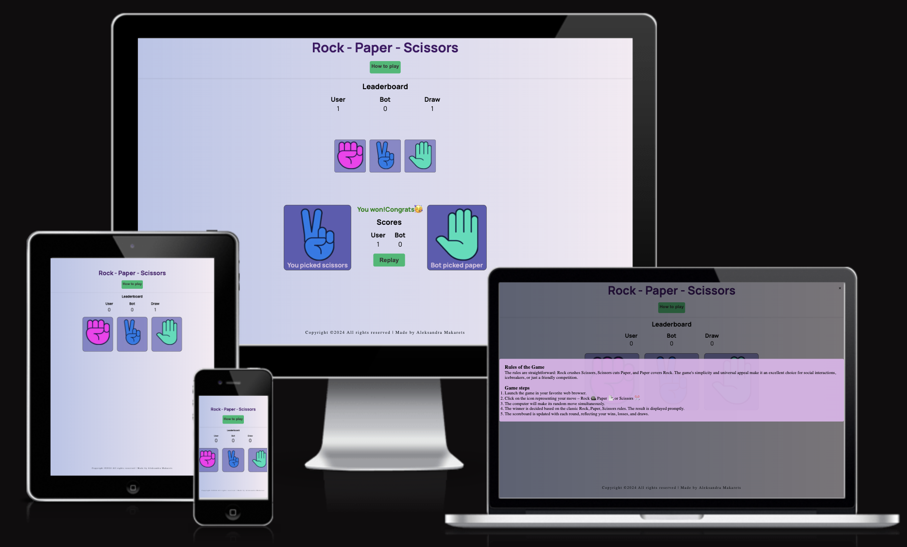
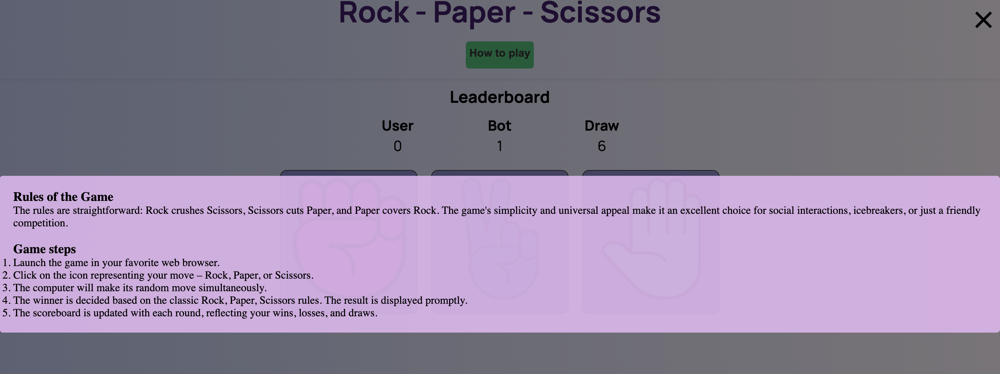
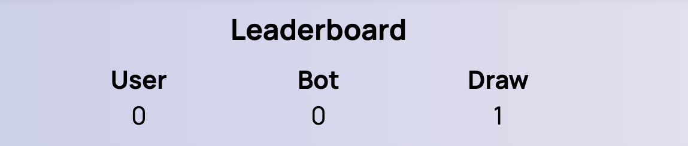
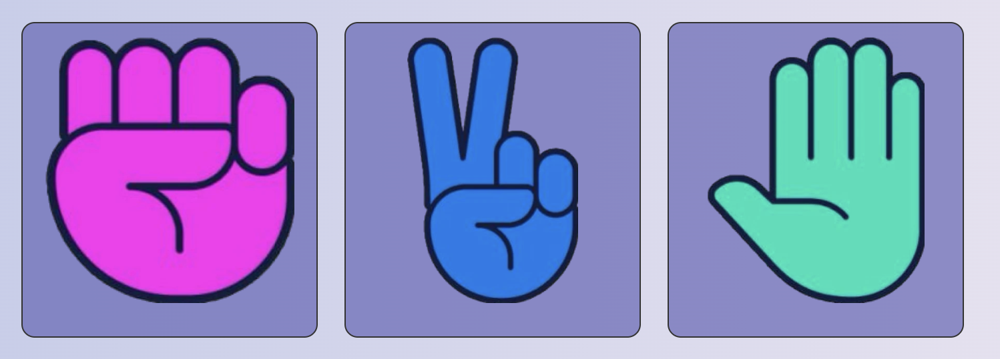
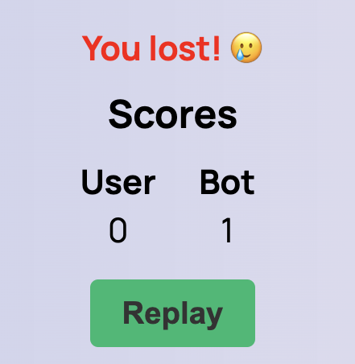
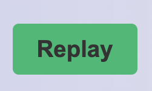
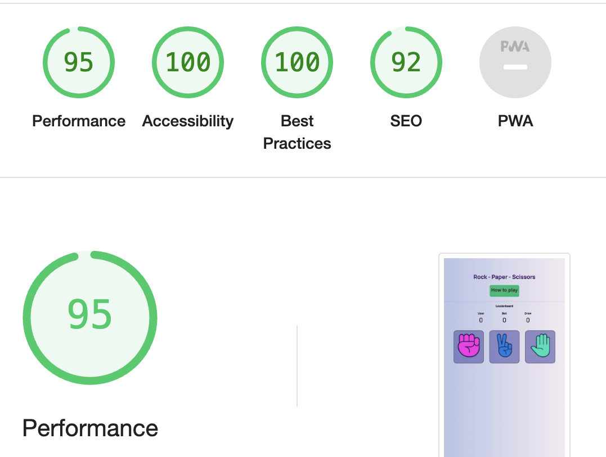

# Rock-Paper-Scissors

The Rock, Paper, Scissors game is more than just a simple hand game – it's a versatile and entertaining activity with a rich history brought to life through modern web technologies. This implementation provides an interactive and enjoyable experience, allowing users to engage in the age-old battle of Rock vs. Paper vs. Scissors against a computer opponent.

 The simplicity of the game makes it accessible to players of all ages. Whether you're a child learning hand games for the first time or an adult seeking a quick and enjoyable break, Rock, Paper, Scissors caters to everyone.

 

  ## Features

### Existing Features

- __Game Rules__

  - Welcome to the Rock, Paper, Scissors game! This classic and timeless game is brought to you for a fun and interactive experience. Challenge yourself or play with friends to see who comes out on top.
  - Clear rules of the game: Understand the rules easily, ensuring a smooth and enjoyable game. The rules and steps of playing the game can be read by clicking the button at the top of the site.
  
  
  

- __User-Friendly Interface__

  - The game boasts a clean and intuitive interface, ensuring a smooth and enjoyable user experience. The layout is designed to be visually appealing, making it easy for players to understand and navigate the game.
  - Right at the top in the center is the Leaderboard, which adds up points for each game.
  - Keeps track of both user, bot and draw.
  
  
- __Play Against the Computer__
  - Challenge yourself against a computer opponent that makes random moves. The game employs JavaScript's Math.random() function to ensure an unpredictable and dynamic gameplay experience.
  - Interesting colored logical pictures located in the center of the page. The user can make his choice in one click.
  

- __Show selected images__

  - Quickly, immediately after the selection, the user can see a comparison of the results of his and the bot's selection.
  -  At the bottom, under the selected images, there is a caption of what exactly the opponents choose. It also ensures accessibility.

  

- __Scoreboard__

  - Keep track of your victories, defeats, and draws with a built-in scoreboard. The scoreboard is prominently displayed, providing instant feedback on your performance throughout multiple rounds.

  

- __Replay Option__

  - The fun doesn't have to stop after a single round. Use the "Replay" button to start a new game immediately after the current round concludes. Enjoy endless rounds of Rock, Paper, Scissors fun!
  - The button is in a prominent place right next to the results, so you can quickly find it and repeat the game.

  

- __Responsive Design__

  - Enjoy the game on various devices, including desktops, tablets, and smartphones.
  

- __Footer__

  - Footer section contains copyright information, the year, a declaration of reserved rights.
  
   

## How to Play

 ### Rules of the game

- __The rules are straightforward: Rock crushes Scissors, Scissors cuts Paper, and Paper covers Rock. The game's simplicity and universal appeal make it an excellent choice for social interactions, icebreakers, or just a friendly competition.__
  
### Game steps

- __Open the Game:__
  - Launch the game in your favorite web browser.
- __Make Your Move:__
  - Click on the icon representing your move – Rock, Paper, or Scissors.
- __Computer's Turn:__
  - The computer will make its random move simultaneously.
- __Determine the Winner:__
  - The winner is decided based on the classic Rock, Paper, Scissors rules. The result is displayed promptly.
- __Score Update::__
  - The scoreboard is updated with each round, reflecting your wins, losses, and draws.
- __Replay:__
  - Click the "Replay" button to start a new round and continue the game.

 ## User Stories

  - As a Visitor, I want to play the Rock, Paper, Scissors game on the website so that I can enjoy a classic and interactive game online.
  - As a User, I want to easily understand the rules of the Rock, Paper, Scissors game, so that I can participate without confusion.
  - As a Player, I want to see visually appealing and clear images representing Rock, Paper, and Scissors during the game, enhancing my gaming experience.
  - As a User, I want to receive immediate feedback on the game results after making a choice, allowing me to know whether I won, lost, or it was a draw.
  - As a Gamer, I want to view and track my personal scores, including wins, losses, and draws, to keep a record of my performance over time.
  - As a Player, I want the website to provide a responsive and enjoyable experience on different devices, including desktops, tablets, and smartphones.
  - As a Visitor, I want to easily navigate the website to find information about the game, rules, and any additional features it offers.
  - As a User, I want the website to have a replay option after completing a game, enabling me to quickly start a new round without unnecessary steps.
  - As a Player, I want the website to have a visually appealing and user-friendly design, making my overall interaction with the game enjoyable.
  - As a Visitor, I want to find information about the creator or author of the website, fostering a sense of connection and providing attribution.

## Testing

The Rock-Paper-Scissors game has undergone thorough testing to ensure a seamless and enjoyable user experience. The testing process covers various aspects of the game, including functionality, responsiveness, and user interaction.
  
### Functional Testing

- Choice Selection: Users can select one of the choices (Rock, Paper, or Scissors) by clicking on the respective buttons.
- Computer's Choice: The computer makes a random and fair selection in response to the user's choice.
- Game Outcome: The game accurately determines the winner, loser, or a draw based on the selected choices.
- Score Tracking: The user's score is correctly updated after each round, reflecting wins, losses, and draws.

### User Interaction

- Responsive Design: Test the game's responsiveness on various devices and screen sizes to ensure a consistent and visually appealing layout.
- Game Replay: Users can restart the game by clicking on the "Replay" button, resetting the score and allowing them to play again.

### Cross-Browser Compatibility

- Browser Testing: The game functions as expected across different web browsers, including Chrome, Firefox, Safari, and Opera.
- On mobile devices, I tested the my site on a Samsung Galaxy A33 5G a with the Samsung browser and an iPhone 12Pro with the Safari browser.

### Validator Testing

- __HTML__ No errors detected, there is a warning when testing using [W3C validator](media/htmlvalidator.png)
  
- __CSS__  No errors were found when passing through the official [(Jigsaw) validator](media/cssvalidator.png)
- __JSHint JavaScript Validator__ No errors were found when passing through the official [(JSHint JavaScript Validator) validator](media/javascriptvalidator.png)

- __Accessibility__   I confirmed that the colors and fonts chosen are easy to read and accessible by running it through 

### Bugs

#### Solved bugs
  
- When I played the game, the opening results were too large and made a scrollable screen window, which was inconvenient.
  - I discovered that due to the large size of the pictures, the indents and the maximum height of the container. That's why I made them smaller and the game already fits on a normal screen without scrolling.
- The X to close the modal window was too small, hard to see.
  - I made it much bigger so it's perfectly visible now.
  
### Unfixed Bugs

- No unfixed bugs

## Technologies

- HTML - To create a basic site.
- CSS - To create a nice, standout front-end and to give a great user experience.
- JavaScript - To enhance web development and create dynamic and interactive user interfaces. 
- Canva - to improve used images and create favicon.

## Deployment

- __The site was deployed to GitHub pages. The steps to deploy are as follows:__
  - In the GitHub repository, navigate to the Settings tab.
  - From the source section drop-down menu, select the Master Branch.
  - Once the master branch has been selected, the page will be automatically; refreshed with a detailed ribbon display to indicate the successful deployment.

The live link can be found here -  [Rock-Paper-Scissors](https://oleksandramakarets.github.io/rock-paper-scissors/)  

## Credits

### Content

- I used the help of GPT chat when writing Javascript functions
- I used this code to write the leaderboard [YouTube](https://www.youtube.com/watch?v=jaVNP3nIAv0&t=1s).
- I got the idea for the game here [YouTube](https://www.youtube.com/watch?v=BLKZ4hd26sg&t=110s).
- I used this code to create a modal window [YouTube](https://www.youtube.com/watch?v=TAB_v6yBXIE);

  
### Media

- The images in the page were taken from [Pixabay](https://pixabay.com/images/search/deal/?order=ec).

## Authors

- [@oleksandramakarets](https://github.com/OleksandraMakarets)

