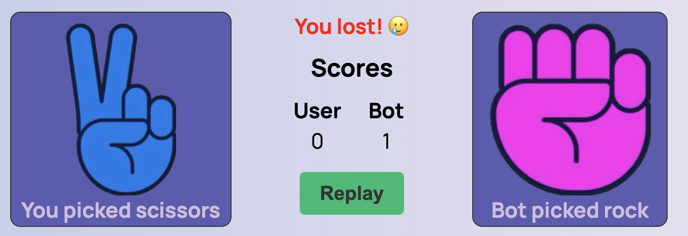

# Rock-Paper-Scissors

The Rock, Paper, Scissors game is more than just a simple hand game – it's a versatile and entertaining activity with a rich history brought to life through modern web technologies. This implementation provides an interactive and enjoyable experience, allowing users to engage in the age-old battle of Rock vs. Paper vs. Scissors against a computer opponent.

 The simplicity of the game makes it accessible to players of all ages. Whether you're a child learning hand games for the first time or an adult seeking a quick and enjoyable break, Rock, Paper, Scissors caters to everyone.
 

  ## Features

### Existing Features

- __Game Rules__

  - Welcome to the Rock, Paper, Scissors game! This classic and timeless game is brought to you for a fun and interactive experience. Challenge yourself or play with friends to see who comes out on top.
  - Clear rules of the game: Understand the rules easily, ensuring a smooth and enjoyable game. The rules and steps of playing the game can be read by clicking the button at the top of the site.
  
  

- __User-Friendly Interface__

  - The game boasts a clean and intuitive interface, ensuring a smooth and enjoyable user experience. The layout is designed to be visually appealing, making it easy for players to understand and navigate the game.
  - Right at the top in the center is the Leaderboard, which adds up points for each game.
  - Keeps track of both user, bot and draw.
  
  
- __Play Against the Computer__
  - Challenge yourself against a computer opponent that makes random moves. The game employs JavaScript's Math.random() function to ensure an unpredictable and dynamic gameplay experience.
  - Interesting colored logical pictures located in the center of the page. The user can make his choice in one click.
  

- __Show selected images__

  - Quickly, immediately after the selection, the user can see a comparison of the results of his and the bot's selection.
  -  At the bottom, under the selected images, there is a caption of what exactly the opponents choose. It also ensures accessibility.

  

- __Scoreboard__

  - Keep track of your victories, defeats, and draws with a built-in scoreboard. The scoreboard is prominently displayed, providing instant feedback on your performance throughout multiple rounds.

  

- __Replay Option__

  - The fun doesn't have to stop after a single round. Use the "Replay" button to start a new game immediately after the current round concludes. Enjoy endless rounds of Rock, Paper, Scissors fun!
  - The button is in a prominent place right next to the results, so you can quickly find it and repeat the game.

  

- __Responsive Design__

  - Enjoy the game on various devices, including desktops, tablets, and smartphones.
  

- __Footer__

  - Footer section contains copyright information, the year, a declaration of reserved rights.
  
   